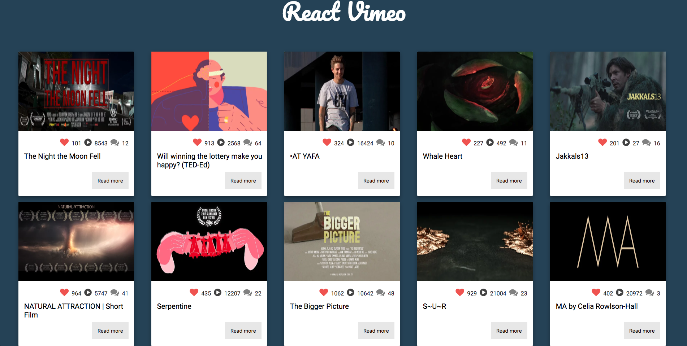
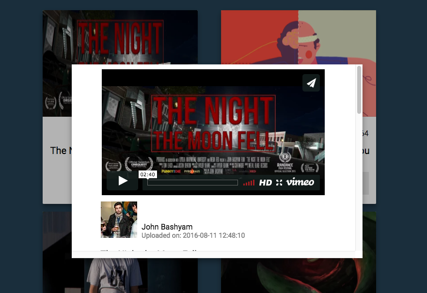

React Vimeo uses React/Redux to display channel information. 

Live Demo: https://lavioli.github.io/vimeo-react/

## Table of Contents

- [How to use React Vimeo](#how-to)
- [Running client](#running-client)
- [Deploy to github pages](#deploy-to-github)

## How to use React Vimeo

* Each result generates the thumbnail, number of likes, number of plays, and comments, and the title

* Clicking the "Read More" button will direct the user to watch the video, and further information such as the description of the video and the tags information are displayed.

## Running client

* Once the repo is cloned, run `npm install ` to install all packages.
* To run, type `npm start ` on localhost:3000

## Deploy to github pages
* Make sure the "homepage" in `package.json` refers to correct github-pages link.
* `npm run deploy`

Made with <3 by Lavie